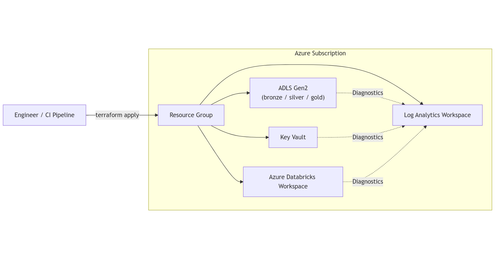
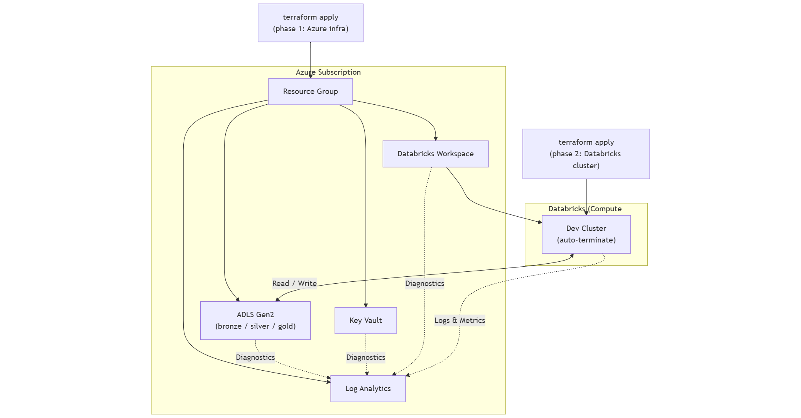

# Terraform Azure Data Platform

**Author:** Bahadir Bulut  
**Company:** Nexence CommV  
**Role:** Senior Data Engineer / Analytics Consultant  
**Contact:** bahadir.bulut@nexence.be
**Location:** Belgium (EU)

---

## Overview

This repository demonstrates a **production-ready Azure data platform** built entirely with Infrastructure as Code (Terraform). It showcases enterprise-grade patterns for modern data engineering with emphasis on **cost optimization**, **security best practices**, and **operational excellence**.

**What this platform provides:**
- Complete medallion architecture (Bronze → Silver → Gold) for data processing
- Secure, keyless authentication using Azure Managed Identity
- Centralized secrets management with Azure Key Vault
- Comprehensive observability and monitoring
- Automated ETL pipelines with Databricks
- Cost-aware design with auto-terminating compute resources

**Target audience:** Data Engineers, Cloud Architects, DevOps Engineers, Technical Recruiters

---

## Quick Start

### Prerequisites
- Azure subscription
- Azure CLI (`az login`)
- Terraform >= 1.6

### Deployment Steps

**Step 1:** Configure your environment
```bash
cp terraform.tfvars.example terraform.tfvars
# Edit terraform.tfvars with your settings
```

**Step 2:** Deploy infrastructure
```bash
terraform init
terraform plan
terraform apply
```

**Step 3 (Optional):** Enable Databricks compute
```bash
# After step 2, get the workspace URL
terraform output databricks_workspace_url

# Update terraform.tfvars with databricks_host
# Re-run terraform apply
```

---

## Architecture

### High-Level Design

The platform consists of **four main layers**:

1. **Foundation Layer** - Resource Group, Networking, Identity
2. **Storage Layer** - ADLS Gen2 with medallion architecture (Bronze/Silver/Gold)
3. **Compute Layer** - Azure Databricks for data processing
4. **Observability Layer** - Log Analytics, Monitoring, Alerts

### Architecture Diagrams

**Phase 1 - Infrastructure Only:**



- Foundation resources provisioned
- Storage containers created
- No compute costs incurred

**Phase 2 - With Databricks Compute:**



- Optional: Interactive cluster for development
- Scheduled ETL jobs with ephemeral clusters
- Auto-termination for cost optimization

---

## Platform Components

### Infrastructure Resources

| Component | Purpose | Key Features |
|-----------|---------|--------------|
| **Resource Group** | Container for all resources | Centralized lifecycle management |
| **ADLS Gen2** | Data Lake storage | Hierarchical namespace, Delta Lake support |
| **Key Vault** | Secrets management | Soft delete, RBAC integration |
| **Log Analytics** | Centralized logging | Diagnostic settings for all resources |
| **Databricks Workspace** | Unified analytics platform | Managed identity, secret scope integration |

### Security Features

✅ **Managed Identity Authentication** - No access keys or connection strings  
✅ **RBAC Integration** - Databricks granted Storage Blob Data Contributor role  
✅ **Key Vault Secrets** - Storage account name and sensitive configs  
✅ **Secret Scope** - Databricks linked to Key Vault  
✅ **TLS 1.2 Minimum** - All storage operations encrypted  
✅ **Private Containers** - No public blob access

### Cost Optimization

💰 **Infrastructure Only (Phase 1):** ~€4-6/month  
💰 **With Databricks Compute (Phase 2):** ~€10-15/month

**Cost-saving features:**
- Conditional resource creation (no compute by default)
- Auto-terminating clusters (20 min idle timeout)
- Ephemeral job clusters (created on-demand)
- Single worker nodes for dev workloads
- LRS storage replication

---

## Data Pipeline (Medallion Architecture)

The platform implements a three-stage data processing pipeline:

### Pipeline Flow

```
Raw CSV Data → Bronze → Silver → Gold → Analytics/BI
```

### Pipeline Stages

#### 🥉 Bronze Layer - Raw Data Ingestion
**Notebook:** `01_bronze_ingest.py`  
**Purpose:** Ingest raw data without transformation  
**Input:** CSV files from sample data  
**Output:** Delta table in `bronze` container  
**Mode:** Append (preserves audit trail)

**What happens:**
- Read CSV with original schema
- Write to Delta format for ACID transactions
- Preserve all raw data for compliance

#### 🥈 Silver Layer - Data Cleansing
**Notebook:** `02_silver_cleanse.py`  
**Purpose:** Clean and standardize data  
**Input:** Bronze Delta table  
**Output:** Delta table in `silver` container  
**Mode:** Overwrite (full refresh)

**Transformations:**
- Remove duplicate records by `order_id`
- Cast `quantity` to integer type
- Cast `unit_price` to double precision
- Validate data quality

#### 🥇 Gold Layer - Business Aggregations
**Notebook:** `03_gold_aggregate.py`  
**Purpose:** Create analytics-ready datasets  
**Input:** Silver Delta table  
**Output:** Delta table in `gold` container  
**Mode:** Overwrite

**Business logic:**
- Calculate revenue per order (quantity × price)
- Aggregate daily revenue totals
- Optimize for BI tool consumption

### Automated ETL Job

**Job Name:** `daily-orders-etl`  
**Schedule:** Daily at 1:00 AM (Europe/Brussels)  
**Cluster Type:** Ephemeral job cluster  
**Notifications:** Email alerts on failure

**Task Dependencies:**
```
Bronze (Task 1)
    ↓
Silver (Task 2) - waits for Bronze
    ↓
Gold (Task 3) - waits for Silver
```

---

## Detailed Component Reference

### 1. Foundation Layer

**Resource Group**
- Single container for all platform resources
- Simplifies lifecycle management and RBAC
- Standard naming: `{project}-{env}-rg`

**Log Analytics Workspace**
- Centralized log aggregation
- Receives diagnostic data from all resources
- Retention configurable per compliance needs

### 2. Storage Layer

**ADLS Gen2 Storage Account**
- **Hierarchical Namespace:** Enabled for big data performance
- **Containers:** bronze, silver, gold (customizable)
- **Replication:** LRS (cost-optimized for dev)
- **Security:** TLS 1.2 minimum, private access only
- **Authentication:** Managed Identity (no keys)

### 3. Secrets Management

**Azure Key Vault**
- Stores storage account name and sensitive configs
- 7-day soft delete for recovery
- Linked to Databricks via secret scope
- Access via `dbutils.secrets.get("keyvault", "secret-name")`

### 4. Compute Layer

**Databricks Workspace**
- **SKU:** Premium (RBAC, audit logs, compliance)
- **Managed Identity:** Automatically enabled
- **Secret Scope:** Linked to Key Vault
- **Cost:** €0 until clusters created

**Interactive Cluster (Optional)**
- Auto-terminates after 20 minutes idle
- Single worker, small VM size
- Latest LTS Spark version
- For development and exploration

**Job Cluster (Automated ETL)**
- Created on-demand per job run
- Terminates immediately after completion
- More cost-efficient than persistent clusters
- Recommended for production workloads

### 5. Observability Layer

**Diagnostic Settings**

All resources send logs/metrics to Log Analytics:

| Resource | Log Categories | Metrics |
|----------|---------------|---------|
| **ADLS Gen2** | StorageRead, StorageWrite, StorageDelete | AllMetrics |
| **Key Vault** | AuditEvent | AllMetrics |
| **Databricks** | workspace, clusters, dbfs, jobs | AllMetrics |

**Benefits:**
- Centralized troubleshooting
- Security audit trail
- Cost analysis and optimization
- Performance monitoring

---

## Configuration Guide

### Step 1: Configure Variables

Copy and edit the example configuration:

```bash
cp terraform.tfvars.example terraform.tfvars
```

**Required variables:**
```hcl
project  = "myproject"      # Short project name
env      = "dev"            # Environment (dev/staging/prod)
owner    = "DataTeam"       # Owner tag
location = "westeurope"     # Azure region
```

**Optional variables:**
```hcl
# Custom container names
adls_container_names = ["bronze", "silver", "gold"]

# Databricks SKU
databricks_sku = "premium"

# Email notifications
notification_emails = ["bahadir.bulut@nexence.be", "team@nexence.be"]
```

### Step 2: Deploy Infrastructure

```bash
# Initialize Terraform
terraform init

# Review planned changes
terraform plan

# Deploy resources
terraform apply
```

**What gets created:**
- Resource Group
- ADLS Gen2 Storage Account with containers
- Azure Key Vault with storage account secret
- Log Analytics Workspace
- Databricks Workspace with managed identity
- RBAC role assignment (Databricks → ADLS)
- Diagnostic settings for all resources

### Step 3: Enable Databricks Compute (Optional)

After infrastructure deployment:

```bash
# Get Databricks workspace URL
terraform output databricks_workspace_url

# Update terraform.tfvars
databricks_host = "https://adb-xxxx.azuredatabricks.net"
repo_url        = "https://github.com/bahadirbulut/terraform-azure-data-platform"
repo_path       = "/Repos/bahadir.bulut@nexence.be/terraform-azure-data-platform"

# Re-apply to create compute resources
terraform apply
```

**Additional resources created:**
- Databricks Secret Scope (linked to Key Vault)
- Interactive cluster with auto-termination
- Git repository integration
- Scheduled ETL job (daily-orders-etl)

---

## Enterprise Features

### Remote State Backend

Enable team collaboration with Azure Storage backend:

1. Create storage account for state:
```bash
az group create --name tfstate-rg --location westeurope
az storage account create --name tfstateXXXX --resource-group tfstate-rg --sku Standard_LRS
az storage container create --name tfstate --account-name tfstateXXXX
```

2. Configure backend:
```bash
cp backend.tf.example backend.tf
# Edit backend.tf with your storage account details
terraform init -migrate-state
```

**Benefits:**
- Shared state for team collaboration
- State locking prevents conflicts
- Version history and backup

### Email Notifications

Configure job failure alerts:

```hcl
# In terraform.tfvars
notification_emails = ["bahadir.bulut@nexence.be", "team@nexence.be"]
```

Alerts triggered on:
- Job execution failures
- Task-level errors
- Timeout exceptions

---

## Troubleshooting

### Common Issues

**❌ Notebooks fail with "Container does not exist"**

Verify containers were created:
```bash
az storage container list --account-name <storage-account> --auth-mode login
```

**❌ terraform apply fails on Databricks resources**

Ensure you're authenticated and `databricks_host` is set:
```bash
az account show
az login  # if needed
```

**❌ Access denied errors in notebooks**

Verify managed identity RBAC:
```bash
az role assignment list --scope /subscriptions/.../storageAccounts/<name>
```

### Getting Help

1. Check Terraform error output for specific resource failures
2. Review Azure Portal for resource status
3. Query Log Analytics for diagnostic logs
4. Verify authentication with `az account show`

---

## Project Structure

```
terraform-azure-data-platform/
├── main.tf                    # Main Terraform configuration
├── variables.tf               # Input variables
├── outputs.tf                 # Output values
├── versions.tf                # Provider version requirements
├── providers.tf               # Provider configurations
├── backend.tf.example         # Remote state backend template
├── terraform.tfvars.example   # Configuration example
├── modules/                   # Reusable Terraform modules
│   ├── resource_group/
│   ├── storage_adls/
│   ├── key_vault/
│   ├── databricks/
│   ├── databricks_cluster/
│   ├── databricks_job/
│   ├── databricks_repo/
│   ├── databricks_secret_scope/
│   ├── diagnostics/
│   └── log_analytics/
├── databricks/
│   └── notebooks/             # ETL notebooks
│       ├── 01_bronze_ingest.py
│       ├── 02_silver_cleanse.py
│       └── 03_gold_aggregate.py
├── sample_data/
│   └── orders/                # Sample CSV data
└── diagrams/                  # Architecture diagrams
```

---

## Next Steps

After successful deployment, consider:

1. **Security Hardening**
   - Enable private endpoints for Key Vault and Storage
   - Configure VNet injection for Databricks
   - Implement network ACLs

2. **Operational Excellence**
   - Set up Azure Monitor alerts for cost thresholds
   - Configure automated backup policies
   - Implement CI/CD pipeline for Terraform

3. **Data Quality**
   - Add data validation rules in Silver layer
   - Implement Great Expectations or similar framework
   - Create data quality dashboards

4. **Performance Optimization**
   - Tune Spark cluster configurations
   - Optimize Delta table layouts
   - Implement partition strategies

---

## License & Disclaimer

**© 2025 Bahadir Bulut — Nexence CommV**

This repository is provided for **reference and portfolio purposes only**.

**Important notices:**
- ✅ Generic configurations and architectures
- ✅ No client data or proprietary information
- ✅ No confidential business logic
- ✅ Sample data for demonstration only

**Usage:**
- Feel free to use as a reference for learning
- Adapt patterns for your own projects
- Not intended for direct production use without customization

**No warranties provided. Use at your own risk.**

---

## Contact & Support

**Bahadir Bulut**  
Senior Data Engineer / Analytics Consultant  
Nexence CommV  
📧 bahadir.bulut@nexence.be  
📍 Belgium (EU)

For questions about this portfolio project or collaboration opportunities, feel free to reach out.
